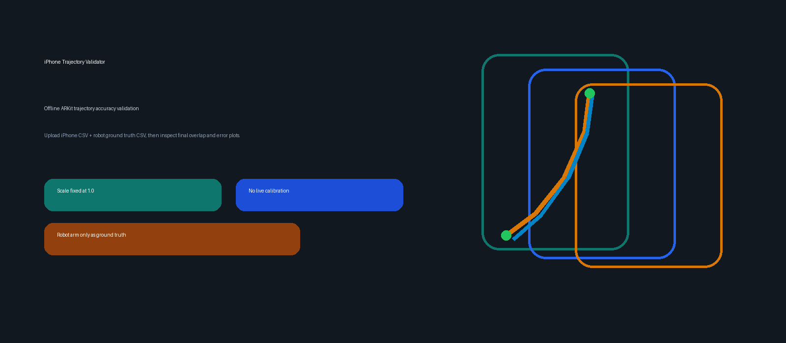
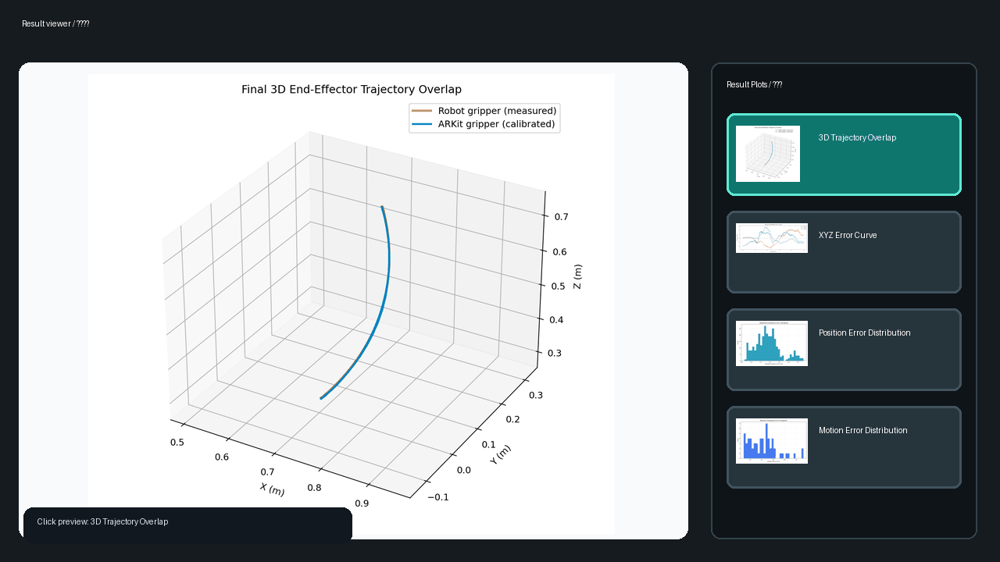
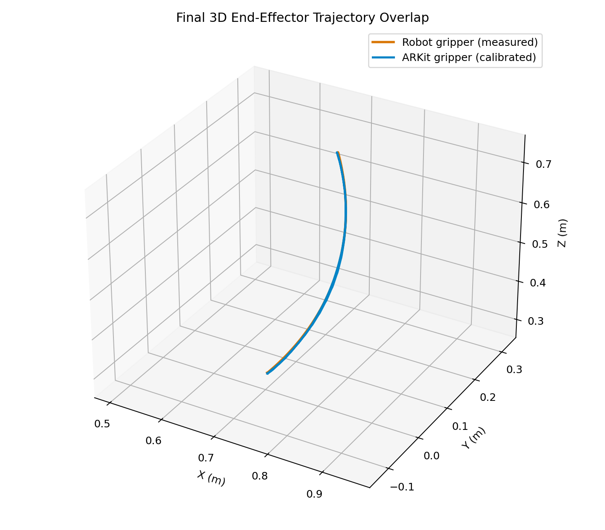
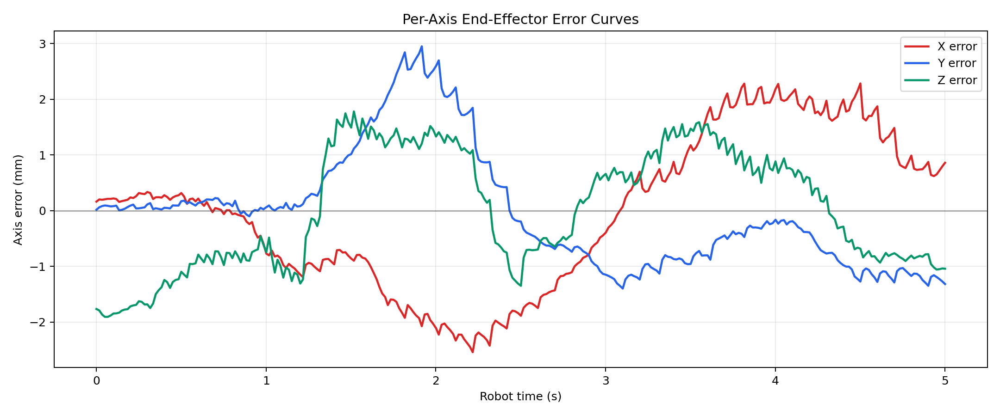
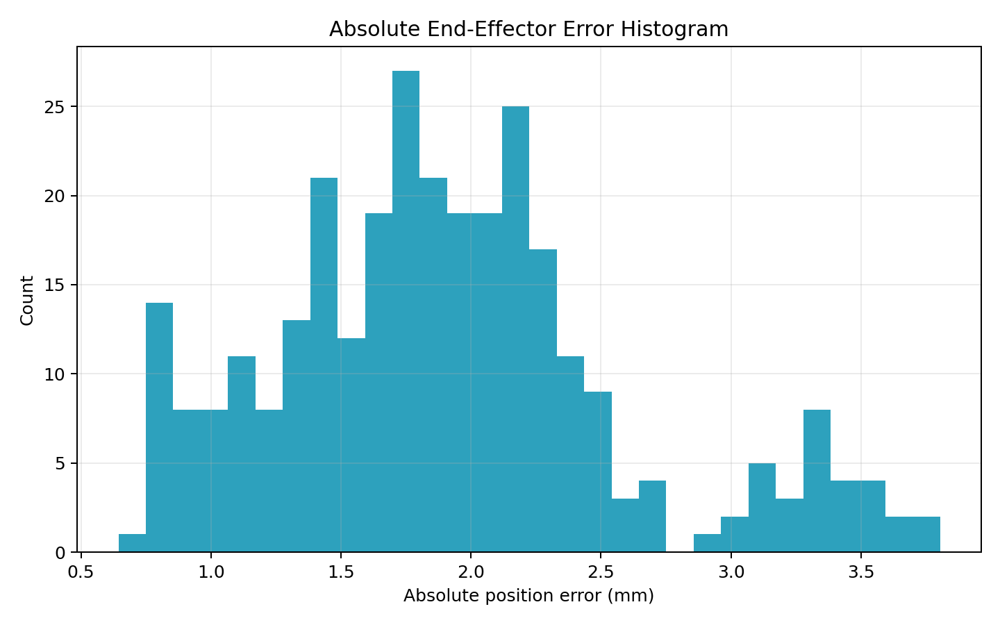
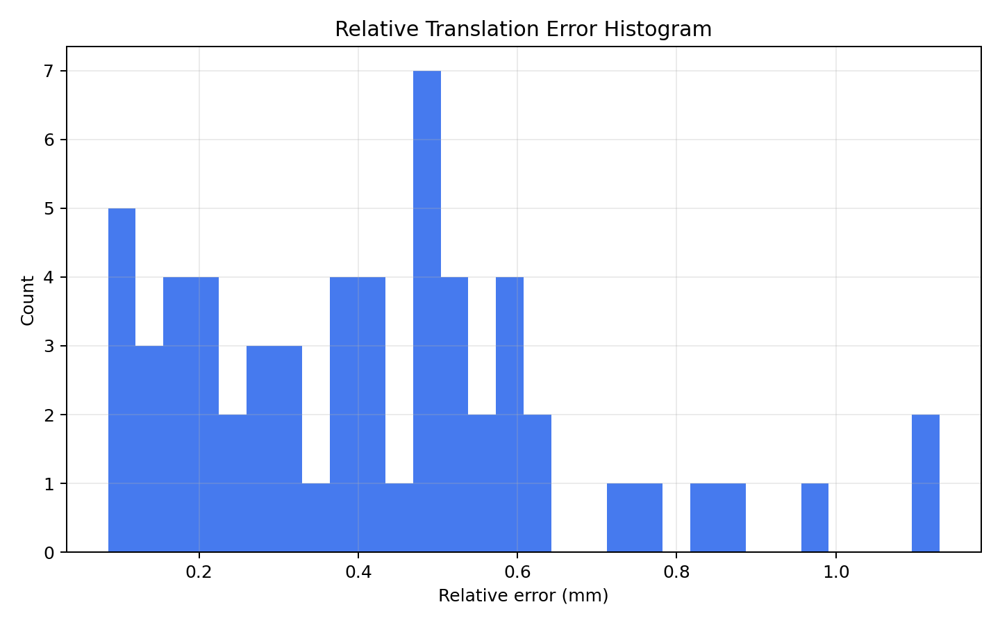

# iPhone Trajectory Validator

<div align="center">


**Offline ARKit trajectory accuracy validation for iPhone pose logs.**

**Language / 语言**: [English](README.md) | [简体中文](README.zh-CN.md)



</div>

---

## What It Is

iPhone Trajectory Validator checks whether an iPhone ARKit trajectory is accurate in its own coordinate system.

It uses a robot end-effector trajectory only as ground truth for validation. The robot coordinate transforms are not meant to be reused in production unless your downstream system explicitly needs robot-base coordinates.

The current validation policy is deliberately conservative:

- ARKit scale is fixed at `1.0`.
- The tool does not fit or refine scale.
- The robot arm is a reference ruler, not a required runtime dependency.
- The GUI is offline-only: load CSV files, generate plots, inspect results.

## Demo



## Result View

The default center panel shows the final 3D trajectory overlap.



Click any result thumbnail on the right to inspect it in the large center panel.

<table>
  <tr>
    <td width="50%"></td>
    <td width="50%"></td>
  </tr>
  <tr>
    <td align="center">XYZ Error Curve</td>
    <td align="center">Position Error Distribution</td>
  </tr>
  <tr>
    <td colspan="2"></td>
  </tr>
  <tr>
    <td colspan="2" align="center">Motion Error Distribution</td>
  </tr>
</table>

## Workflow

```text
iPhone ARKit CSV
        +
Robot end-effector CSV
        |
        v
Time synchronization
        |
        v
Fixed scale = 1.0
        |
        v
Hand-eye + session alignment for evaluation only
        |
        v
Error metrics + result plots
```

## What The Tool Outputs

Each validation run creates a timestamped output folder under `offline_calibration_output/` containing:

- `trajectory_overlap_3d.png`: final 3D overlap between robot ground truth and calibrated ARKit end-effector trajectory
- `axis_error_curves.png`: X/Y/Z error over matched samples
- `absolute_error_histogram.png`: position error distribution
- `relative_error_histogram.png`: relative motion error distribution
- `offline_calibration_result.json`: numeric metrics and transforms used for evaluation

The most important numbers shown in the GUI are:

- matched pair count
- mean position error
- RMSE position error
- maximum position error
- time shift

## Installation

```bash
pip install -r requirements.txt
```

## Run The GUI

Windows:

```powershell
.\run_validator_windows.ps1
```

macOS / Linux:

```bash
chmod +x ./run_validator_mac.sh
./run_validator_mac.sh
```

Or directly:

```bash
python iphone_trajectory_validator.py
```

## Run From Command Line

```bash
python iphone_trajectory_validator.py --mode offline \
  --arkit-csv path/to/iphone_pose.csv \
  --sensor-csv path/to/robot_end_effector.csv \
  --output-dir offline_calibration_output
```

## Data Requirements

iPhone ARKit CSV should contain pose samples with position and quaternion fields.

Robot CSV should contain robot end-effector pose samples with position and quaternion or matrix-derived pose fields supported by the loader.

The two logs should cover the same motion interval and include enough movement for reliable alignment.

## Interpretation

If the final overlap is tight and the error metrics are small, the practical conclusion is:

> The iPhone ARKit trajectory is reliable in its own coordinate system for this capture setup.

You do not need to reuse robot transforms unless your production task needs robot-base coordinates. For pure iPhone-coordinate workflows, the robot arm is only the validation reference.

## Why Scale Is Fixed At 1.0

Experiments showed that ARKit scale is already consistent enough for this validation setup. Fitting scale can reduce error on one sample but may overfit the capture. This tool therefore fixes `scale_factor = 1.0` and evaluates the trajectory without scale fitting.

## License

MIT
